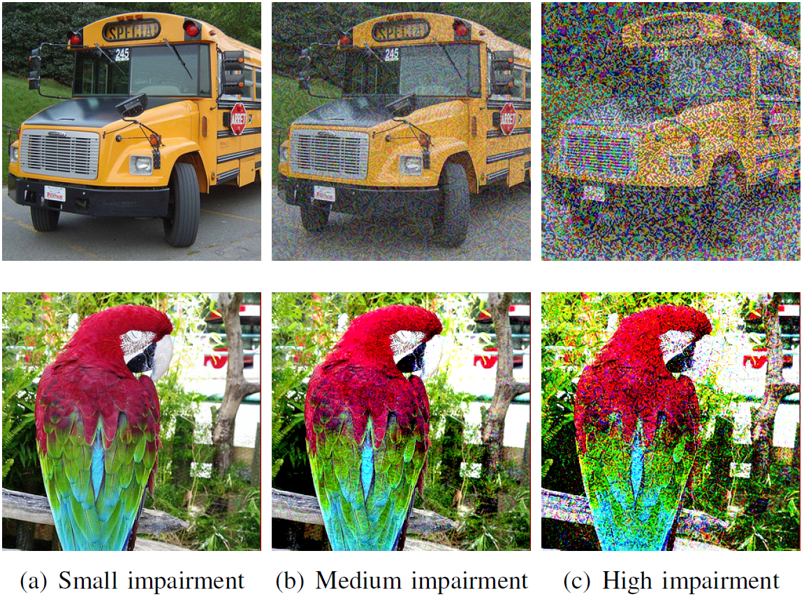

# IQA-CNN-Adversarial-Attacks
Perceptual Evaluation of Adversarial Attacks for CNN-based Image Classification (dataset)

# Introduction
Deep neural networks (DNNs) have recently achieved state-of-the-art performance and provide significant progress in many machine learning tasks. However, recent studies have shown that DNNs are vulnerable to adversarial attacks. For instance, in the image classification domain, adding small imperceptible perturbations to the input image is sufficient to fool the DNN and to cause misclassification. The perturbed image, called adversarial example, should be visually as close as possible to the original image. However, all the works proposed in the literature for generating adversarial examples have used the Lp norms (L0, L2 and Linf) as distance metrics to quantify the similarity between the original image and the adversarial example. Nonetheless, the Lp norms do not correlate with human judgment, making them not suitable to reliably assess the perceptual similarity/fidelity of adversarial examples. Consequently, we present a database for visual fidelity assessment of adversarial examples. We evaluated the performance of 15 state-of-the-art full-reference image fidelity assessment metrics that could substitute Lp norms. The database as well as subjective scores are publicly available to help designing new metrics for adversarial examples and to facilitate future research works.

For a more detailed description of the project you may check the following <a href="Paper_QoMEX19.pdf" target="_blank">Paper.</a>

## Subjective evaluation

The database is specifically dedicated to the perceptual assessment of adversarial perturbations against DNNs. The dataset includes 360 images that have been generated using six prominent adversarial attacks with different levels of perturbations:

- Fast Gradient Sign Method (FGSM)
- Basic Iterative Method (BIM)
- Deepfool
- Carlini-Wagner (C&W)
- Projected Gradient Descent (PGD)
- Momentum Iterative Method (MIM)

The subjective data of 18 human subjects have been collected, where each subject was asked to rate the fidelity of the adversarial example with respect to the reference image. 

Our goal is to use the ground truth obtained from human judgments to evaluate the performance of the 03 distance metrics (L0, L2 and L1) and to assess the performance of 15 state-of-theart full-reference image fidelity assessment metrics, as well as can be used to design new metrics for adversarial examples.

## Download
You can download all images --> [Database](https://drive.google.com/drive/folders/16U4Ecq8t5Dzfvxdy3YqjLwYEl9pTqFNu?usp=sharing) <--

Microsoft Excel spreadsheet, giving all subjective results is included in the above shared folder in Google Drive.

## How to cite the database
If you use this database in your research, we kindly ask you to reference the following paper and URL link of this webpage: 
>S.A. Fezza, Y. Bakhti, W. Hamidouche and O. Déforges, "Perceptual Evaluation of Adversarial Attacks for CNN-based Image Classification," in Proc. IEEE  11th International Conference on Quality of Multimedia Experience (QoMEX), Berlin, Germany, 2019.
Link: https://github.com/safezza/IQA-CNN-Adversarial-Attacks
